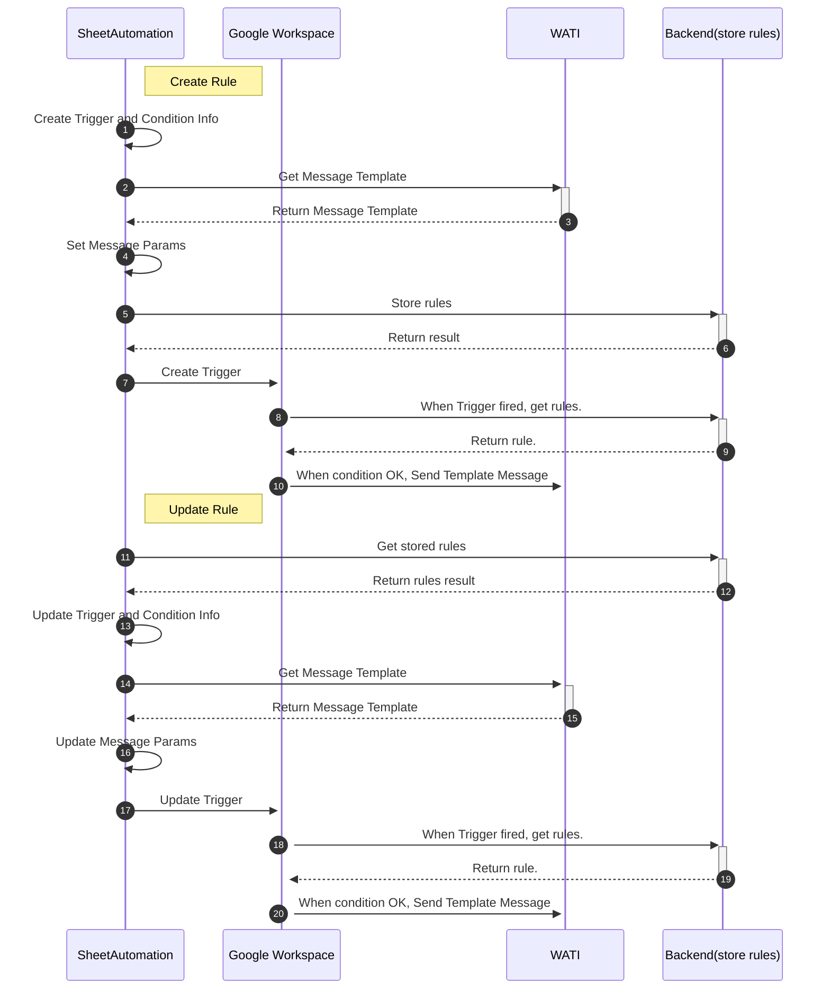

```mermaid
sequenceDiagram
autonumber
participant SheetAutomation
participant Google Workspace
participant WATI 
participant Backend(store rules)

Note right of SheetAutomation: Create Rule
SheetAutomation ->>SheetAutomation: Create Trigger and Condition Info
SheetAutomation ->>+WATI: Get Message Template
WATI -->>-SheetAutomation: Return Message Template
SheetAutomation ->>SheetAutomation: Set Message Params
SheetAutomation ->>+Backend(store rules): Store rules 
Backend(store rules) -->>-SheetAutomation: Return result
SheetAutomation ->>+Google Workspace: Create Trigger 
Google Workspace ->>+Backend(store rules): When Trigger fired, get rules.
Backend(store rules)-->>-Google Workspace: Return rule.
Google Workspace ->>+WATI: When condition OK, Send Template Message

Note right of SheetAutomation: Update Rule
SheetAutomation ->>+Backend(store rules): Get stored rules
Backend(store rules) -->>-SheetAutomation: Return rules result
SheetAutomation ->>SheetAutomation: Update Trigger and Condition Info
SheetAutomation ->>+WATI: Get Message Template
WATI -->>-SheetAutomation: Return Message Template
SheetAutomation ->>SheetAutomation: Update Message Params
SheetAutomation ->>+Google Workspace: Update Trigger 
Google Workspace ->>+Backend(store rules): When Trigger fired, get rules.
Backend(store rules)-->>-Google Workspace: Return rule.
Google Workspace ->>+WATI: When condition OK, Send Template Message
```
